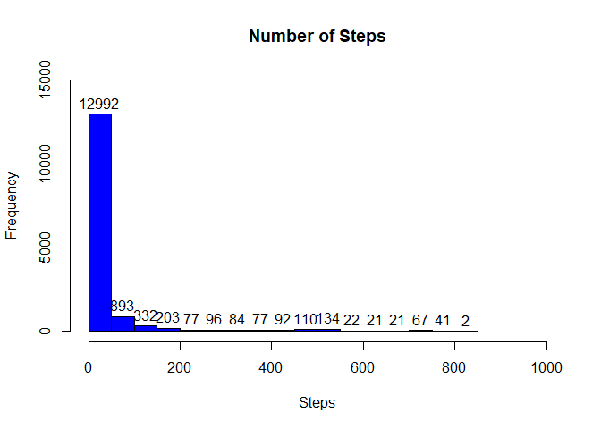
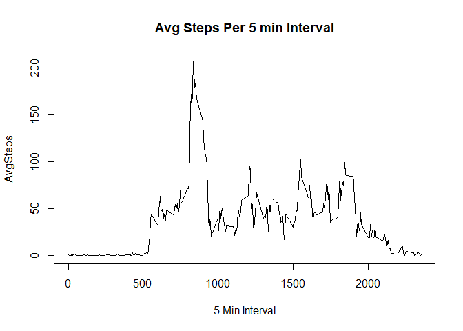
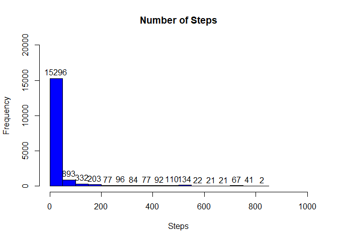
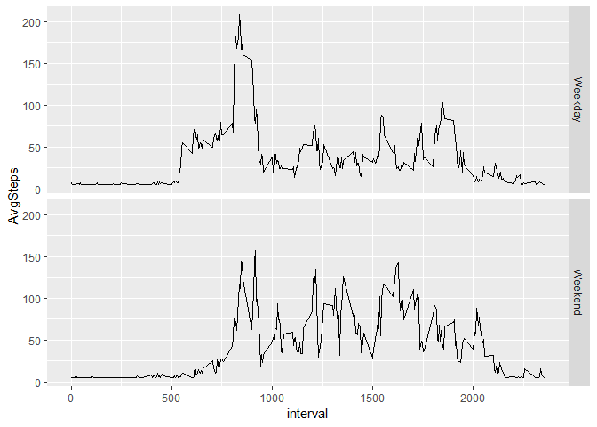

This assignment makes use of data from a personal activity monitoring device. This device collects data at 5 minute intervals through out the day. The data consists of two months of data from an anonymous individual collected during the months of October and November, 2012 and include the number of steps taken in 5 minute intervals each day. 

1. First, load and pre-process the data


```r
setwd("C:/Coursera/R/Course 5/RepData_PeerAssessment1")
filename<-"activity.zip"

if (!file.exists(filename)) { 
  fileURL <- "https://d396qusza40orc.cloudfront.net/repdata%2Fdata%2Factivity.zip"
  download.file(fileURL,filename)
  }
if (!file.exists("activity.csv")) {
  unzip(filename) 
}
data<-read.csv("activity.csv", stringsAsFactors = FALSE)
data$date <- as.Date(as.character(data$date))
```

2. Next, explore "steps" variable (e.g., Sum, Histogram, Mean and Median)

a) The total number of *steps* in the data is:

```r
sum(data$steps, na.rm = T)
```

```
## [1] 570608
```

b) The histogram of number of *steps* by 5 minute intervals is:

```r
hist(data$steps, col = "blue", main = "Number of Steps", ylim = c(0, 15000),  
     xlim = c(0, 1000), xlab = "Steps", labels = T, breaks = 20)
```

<!-- -->

c) The Mean and Median number of *steps* are (respectively):

```r
mean(data$steps, na.rm = T)
```

```
## [1] 37.3826
```

```r
median(data$steps, na.rm = T)
```

```
## [1] 0
```

3. The following plot shows the "average"" daily activity pattern per 5 minute interval. Averages were calculated across all days tracked. The dplyr package will be loaded for graphing.  


```r
library(dplyr)
```
a) The plot is created by calculating averages for each interval across all days: 

```r
dataint<-data %>% group_by(interval) %>% summarise(AvgSteps = mean(steps, na.rm = T))
plot(dataint, main = "Avg Steps Per 5 min Interval", type = "l",
     xlab = "5 Min Interval")
```

<!-- -->

b) The maximum number of *average steps* (206) is shown to be at interval 835:

```r
dataint %>% filter(AvgSteps == max(AvgSteps))
```

```
## # A tibble: 1 x 2
##   interval AvgSteps
##      <int>    <dbl>
## 1      835     206.
```

4. The following identifies and replaces missing values in "steps" with the overall Mean of "steps" and recalculates: Sum, Histogram, Mean and Median:  

a) The number of NAs in the data set is:

```r
sum(is.na(data))
```

```
## [1] 2304
```

b) The following substitutes NAs with the Mean number of steps in the data:

```r
data2<-data
data2$steps[is.na(data2$steps)] <- mean(data2$steps, na.rm=TRUE)
hist(data2$steps, col = "blue", main = "Number of Steps", ylim = c(0, 20000),  
     xlim = c(0, 1000), xlab = "Steps", labels = T, breaks = 20)
```

<!-- -->

c) The following recalculates the Mean and Median number of steps with NAs replaced by the Mean (which are shown to be similar to the previous output):

```r
mean(data2$steps, na.rm = T)
```

```
## [1] 37.3826
```

```r
median(data2$steps, na.rm = T)
```

```
## [1] 0
```

5. Lastly, the following compares the average steps (per 5 minute interval) between weekdays and weekends.  

a) Two new fields are created reflecting weekday and whether a weekday or weekend from the dates of data capture provided:

```r
data2$wday<-weekdays(data2$date)
data2<- mutate(data2, wday2 = ifelse(grepl("S", wday), "Weekend", "Weekday"))
```

b) Two plots are created comparing the average number of steps between weekdays and weekends:

```r
data2$wday2<-as.factor(data2$wday2)
data2int<-data2 %>% group_by(interval, wday2) %>% summarise(AvgSteps = mean(steps))
library(ggplot2)
ggplot(data2int)+geom_line(aes(interval, AvgSteps))+facet_grid(rows = vars(wday2))
```

<!-- -->
